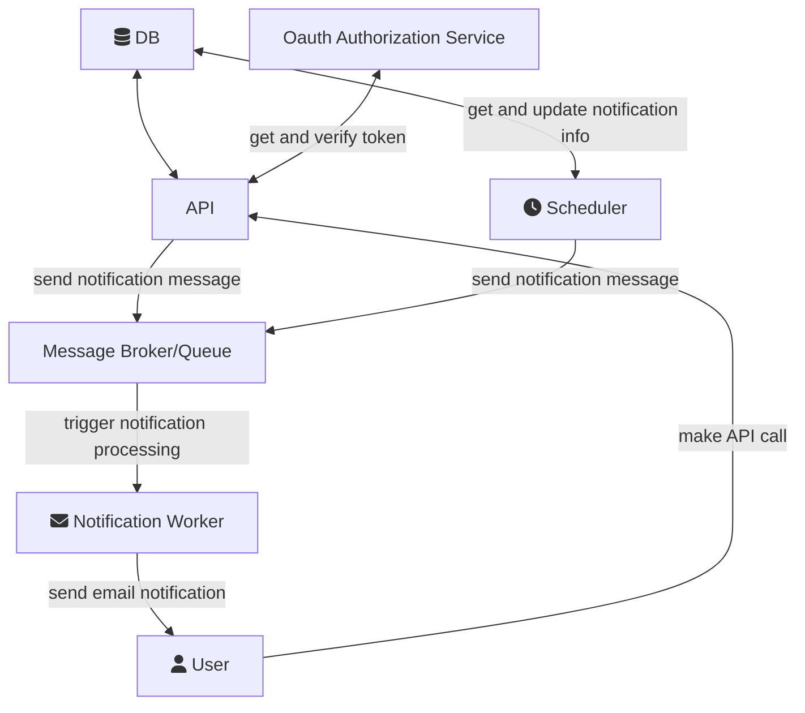

# Biblioteka
## Opis
System biblioteki oparty o mikroserwisy, pozwala na przechowywanie i zarządzanie informacjami o dostępnych zbiorach.

## Architektura

### DB
Baza danych SQL przechowuje informacje o użytkownikach oraz dostępnych zbiorach.

: **Wybór bazy danych:** Na etapie prototypowania możliwe jest użycie SQLite, jednakże wraz z rozwojem projektu wymagane jest przejście na bardziej rozbudowany silnik najlepiej PostgreSQL.

#### Przydatne moduły
* Pony ORM - prosty ORM idealny do prototypowania.
* SQL Alchemy - rozbudowany i dobrze udokumentowany ORM ze wsparciem dla migracji itd.

### API

#### Przydatne moduły
* FastAPI - asynchroniczny framework webowyy.
* Pydantic - moduł do serializacji danych wbudowany w FastAPI, poza serializacją posiada wbudowane wsparcie dla wczytywanie plików/zmiennych konfiguracyjnych z różnych źródeł.

### OAuth Authorization Service
Serwis odpowiedzialny za uwierzytelnianie użytkowników i generowanie tokenów zgodnie z protokołem OAuth2.

#### Przydatne moduły
* Keycloak - gotowe rozwiązanie zgodne z OAuth2, odpowiadające za uwierzytelnianie i zarządzanie użytkownikami/aplikacjami.

### Scheduler

Serwis monitorujący rekordy w bazie danych i odpowiedzialny za przesłanie informacji o zbliżającym się terminie zwrócenia książki lub kończącej się rezerwacji, poprzez wysłanie odpowiedniej wiadomości do kolejki.

#### Przydatne moduły
* AIOPika - asynchroniczny moduł do obsługi RabbitMQ.
* Pydantic - obsługa konfiguracji i serializacja danych.

### Message Broker/Queue

Message Broker lub prosta kolejka odpowiedzialna za komunikację pomiędzy Schedulerem oraz Notification Workerem.

#### Przydatne moduły
* RabbitMQ

### Notification Worker
Odpowiada za obsługę wiadomości z kolejki i przesłanie odpowiedniego powiadomienia do użytkownika.

#### Przydatne moduły
* AIOPika - asynchroniczny moduł do obsługi RabbitMQ.
* Pydantic - obsługa konfiguracji i serializacja danych.
* smtplib - domyślny klient do obsługi wiadomości email.

### Użytkownik
W systemie rozróżnić można następujące grupy użytkowników:
* **Użytkownik biblioteki** - Może przeglądać zasoby i rezerwuje książki do wypożyczenia.
* **Bibliotekarz** - Może przeglądać zasoby, dodaje/usuwa/aktualizuje zasoby, zarządza stanem danego zasobu (zarządza, wydaje/wypożycza, odbiera/oznacza jako zwrócone)

## Zadania
Kolejność ralizacji podpunktów może być dowolna o ile jest to możliwe:
1. Zaprojektuj schemat bazy danych i przedstaw go na diagramie ERD
2. Zastanów się które serwisy będą korzystać z tych samych komponentów, może warto zaimplementować je w formie współdzielonych paczek
3. Zaimplementuj Notification Service, Scheduler, API
4. Utwórz pliki Dockerfile dla zaimplementowanych serwisów
5. Utwórz plik docker-compose.yml dla całego projektu